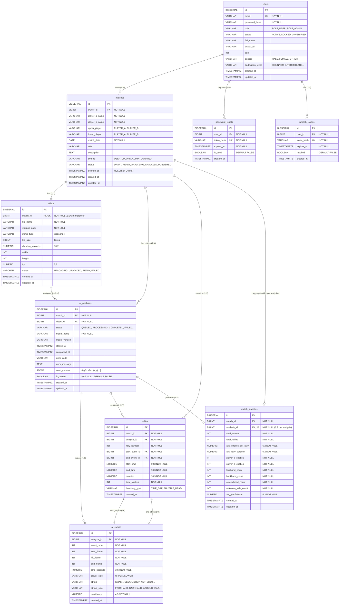

# Thiết kế Cơ Sở Dữ Liệu & ERD (Entity Relationship Diagram)

* **Dự án:** PBL6 Badminton - Match Analysis & Replay Platform
* **Hệ quản trị CSDL:** **PostgreSQL 15+**
* **Migration Tool:** **Flyway** (Spring Boot 3)
* **Thư mục:** `docs/02-design/`
* **Ngày thiết kế:** 2026-10-08

---

## 1. Sơ đồ Quan hệ Thực thể (Mermaid ERD)



---

## 2. Chi Tiết Kiểu Dữ Liệu, Ràng Buộc & Khóa Ngoại (Data Dictionary)

### 2.1. Bảng `users` & Quản lý Xác thực
* **`id`**: `BIGSERIAL` (Khóa chính tự tăng 64-bit, hiệu năng B-Tree vượt trội so với UUID v4 ngẫu nhiên).
* **`email`**: `VARCHAR(255) NOT NULL UNIQUE` (Đánh chỉ mục duy nhất cho đăng nhập).
* **`password_hash`**: `VARCHAR(255) NOT NULL` (Lưu chuỗi băm BCrypt $\approx 60$ ký tự).
* **`role`**: `VARCHAR(20) NOT NULL DEFAULT 'ROLE_USER'` (Check constraint: `'ROLE_USER'`, `'ROLE_ADMIN'`).
* **`status`**: `VARCHAR(20) NOT NULL DEFAULT 'ACTIVE'` (Check constraint: `'ACTIVE'`, `'LOCKED'`, `'UNVERIFIED'`).
* **`gender`**: `VARCHAR(20)` (Check constraint: `'MALE'`, `'FEMALE'`, `'OTHER'`).
* **`badminton_level`**: `VARCHAR(30)` (Check constraint: `'BEGINNER'`, `'INTERMEDIATE'`, `'ADVANCED'`, `'PRO'`).

### 2.2. Bảng `password_resets` & `refresh_tokens`
* **`password_resets.user_id`**: `BIGINT NOT NULL REFERENCES users(id) ON DELETE CASCADE`.
* **`password_resets.token_hash`**: `VARCHAR(255) NOT NULL UNIQUE` (Token ngẫu nhiên băm SHA-256).
* **`refresh_tokens.user_id`**: `BIGINT NOT NULL REFERENCES users(id) ON DELETE CASCADE`.
* **`refresh_tokens.token_hash`**: `VARCHAR(255) NOT NULL UNIQUE` (Token làm mới).

### 2.3. Bảng `matches`
* **`owner_id`**: `BIGINT NOT NULL REFERENCES users(id) ON DELETE CASCADE`.
* **`upper_player` / `lower_player`**: `VARCHAR(20) NOT NULL` (Check constraint: `'PLAYER_A'`, `'PLAYER_B'`).
* **`match_date`**: `DATE NOT NULL DEFAULT CURRENT_DATE`.
* **`status`**: `VARCHAR(20) NOT NULL DEFAULT 'DRAFT'` (Check constraint: `'DRAFT'`, `'READY'`, `'ANALYZING'`, `'ANALYZED'`, `'PUBLISHED'`).
* **`source`**: `VARCHAR(20) NOT NULL DEFAULT 'USER_UPLOAD'` (Check constraint: `'USER_UPLOAD'`, `'ADMIN_CURATED'`).
* **`deleted_at`**: `TIMESTAMPTZ NULL` (Dấu hiệu xóa mềm, `NULL` nghĩa là bản ghi còn hoạt động).

### 2.4. Bảng `videos` (Quan hệ 1-1 với `matches`)
* **`match_id`**: `BIGINT NOT NULL UNIQUE REFERENCES matches(id) ON DELETE CASCADE` (Đảm bảo $1$ Match chỉ gắn với duy nhất $1$ Video chính theo quyết định Q1).
* **`storage_path`**: `VARCHAR(1000) NOT NULL` (Key đối tượng trong MinIO: `videos/{match_id}/{uuid}.mp4`).
* **`status`**: `VARCHAR(20) NOT NULL DEFAULT 'UPLOADING'` (Check constraint: `'UPLOADING'`, `'UPLOADED'`, `'READY'`, `'FAILED'`).
* **`duration_seconds`**: `NUMERIC(10, 2)` (Hỗ trợ video lên tới hàng chục giờ với độ chính xác đến $0.01$ giây).

### 2.5. Bảng `ai_analyses`
* **`match_id`**: `BIGINT NOT NULL REFERENCES matches(id) ON DELETE CASCADE`.
* **`video_id`**: `BIGINT NOT NULL REFERENCES videos(id) ON DELETE CASCADE`.
* **`status`**: `VARCHAR(20) NOT NULL DEFAULT 'QUEUED'` (Check constraint: `'QUEUED'`, `'PROCESSING'`, `'COMPLETED'`, `'FAILED'`, `'UNSUPPORTED'`, `'CANCELLED'`).
* **`court_corners`**: `JSONB` (Lưu mảng tọa độ 4 góc sân dạng JSON chuẩn của PostgreSQL: `[{"x": 120, "y": 340}, ...]`).
* **`is_current`**: `BOOLEAN NOT NULL DEFAULT FALSE` (Cờ chỉ định phiên phân tích có hiệu lực chính thức hiện tại).

### 2.6. Bảng `ai_events`
* **`analysis_id`**: `BIGINT NOT NULL REFERENCES ai_analyses(id) ON DELETE CASCADE`.
* **`time_seconds`**: `NUMERIC(10, 3) NOT NULL` (Độ chính xác miligiây $0.001$s phục vụ tua video chính xác tuyệt đối trên Video.js).
* **`player_side`**: `VARCHAR(20) NOT NULL` (Check constraint: `'UPPER'`, `'LOWER'`).
* **`stroke`**: `VARCHAR(50) NOT NULL` (Check constraint: `'SERVE'`, `'SMASH'`, `'CLEAR'`, `'DROP'`, `'LIFT'`, `'DRIVE'`, `'NET_SHOT'`, `'PUSH'`, `'UNKNOWN'`).
* **`stroke_side`**: `VARCHAR(30) NOT NULL DEFAULT 'UNKNOWN'` (Check constraint: `'FOREHAND'`, `'BACKHAND'`, `'AROUNDHEAD'`, `'UNKNOWN'`).
* **`confidence`**: `NUMERIC(4, 3) NOT NULL` (Giá trị xác suất từ $0.000$ đến $1.000$).

### 2.7. Bảng `rallies`
* **`match_id`**: `BIGINT NOT NULL REFERENCES matches(id) ON DELETE CASCADE`.
* **`analysis_id`**: `BIGINT NOT NULL REFERENCES ai_analyses(id) ON DELETE CASCADE`.
* **`start_event_id`**: `BIGINT NOT NULL REFERENCES ai_events(id) ON DELETE CASCADE`.
* **`end_event_id`**: `BIGINT NOT NULL REFERENCES ai_events(id) ON DELETE CASCADE`.
* **`boundary_type`**: `VARCHAR(30) NOT NULL DEFAULT 'TIME_GAP'` (Check constraint: `'TIME_GAP'`, `'SHUTTLE_DEAD'`, `'SERVICE_DETECTED'`).

### 2.8. Bảng `match_statistics`
* **`match_id`**: `BIGINT NOT NULL REFERENCES matches(id) ON DELETE CASCADE`.
* **`analysis_id`**: `BIGINT NOT NULL UNIQUE REFERENCES ai_analyses(id) ON DELETE CASCADE` (Đảm bảo mỗi phiên phân tích chỉ sinh duy nhất 1 bản ghi tổng hợp thống kê).

---

## 3. Quyết định Thiết kế Chỉ Mục (Indexing Decisions & Rationale)

Hệ thống sử dụng các chiến lược đánh chỉ mục nâng cao của PostgreSQL nhằm đạt tiêu chuẩn phản hồi **$\le 2s$ (NFR-PER-01)**:

### 3.1. Partial Index cho Xóa mềm (Soft Delete)
```sql
CREATE INDEX idx_matches_owner_active 
ON matches(owner_id, created_at DESC) 
WHERE deleted_at IS NULL;
```
* **Lý do:** Truy vấn xem trận đấu của tôi (`GET /api/matches`) chiếm tần suất rất cao. Bằng cách thêm mệnh đề `WHERE deleted_at IS NULL`, chỉ mục này **chỉ lưu các trận đấu đang hoạt động**. Cây B-Tree nhỏ hơn $30-50\%$, nằm gọn trong RAM đệm (Buffer Cache) và quét nhanh hơn so với index toàn bảng.

### 3.2. Partial Index cho Duyệt Thư viện Công khai (Public Library)
```sql
CREATE INDEX idx_matches_public_browse 
ON matches(match_date DESC, created_at DESC) 
WHERE status = 'PUBLISHED' AND deleted_at IS NULL;
```
* **Lý do:** API `GET /api/public-matches` của khách vãng lai và người dùng luôn luôn lọc cố định điều kiện `status = 'PUBLISHED' AND deleted_at IS NULL`. Index này biến câu lệnh truy vấn công khai thành một phép **Index-Only Scan** cực nhanh.

### 3.3. Ràng buộc Toàn vẹn Độc nhất qua Partial Unique Index (`is_current`)
```sql
CREATE UNIQUE INDEX uq_ai_analyses_current_per_match 
ON ai_analyses(match_id) 
WHERE is_current = TRUE;
```
* **Lý do:** Một trận đấu có thể có 5-10 phiên phân tích (lịch sử thử lại, thất bại, v.v.), nhưng **tại một thời điểm chỉ được phép có duy nhất 1 phiên là `is_current = TRUE`**. Ràng buộc Partial Unique Index ở mức Database Engine này loại bỏ hoàn toàn nguy cơ tranh chấp dữ liệu (Race Condition) khi nhiều tiến trình chạy song song.

### 3.4. Chỉ mục phục vụ Replay Timeline & Tua Video (Milisecond Seek)
```sql
CREATE INDEX idx_ai_events_analysis_order ON ai_events(analysis_id, event_order ASC);
CREATE INDEX idx_ai_events_analysis_time  ON ai_events(analysis_id, time_seconds ASC);
CREATE INDEX idx_rallies_analysis_number  ON rallies(analysis_id, rally_number ASC);
```
* **Lý do:** Trình phát video khi khởi động cần tải toàn bộ stroke markers theo thứ tự thời gian (`time_seconds`). Index tổng hợp này giúp fetch hàng trăm sự kiện của một trận đấu trong vòng $< 5\text{ms}$.

---

## 4. Quyết định về Xóa Mềm (Soft Delete Architecture)

1. **Phạm vi áp dụng:**
   * Chỉ áp dụng trực tiếp trường `deleted_at TIMESTAMPTZ` trên thực thể **`matches`**.
   * Người dùng sở hữu trận đấu chỉ có thể kích hoạt Soft Delete (`UPDATE matches SET deleted_at = NOW()`).
2. **Xử lý các thực thể con phụ thuộc (`videos`, `ai_analyses`, `ai_events`, `rallies`, `match_statistics`):**
   * **Không cần gán `deleted_at` vào các bảng con:** Tất cả các API nghiệp vụ truy vấn sự kiện hay video đều bắt buộc `JOIN` qua `matches` hoặc kiểm tra `matches.deleted_at IS NULL`. Khi trận đấu bị ẩn, toàn bộ video và sự kiện liên quan tự động ẩn theo.
   * **Bảo vệ toàn vẹn dữ liệu:** Không gây ra tình trạng đứt gãy khóa ngoại giữa các bảng con.
3. **Cơ chế Hard Delete (Dọn dẹp hệ thống):**
   * Các khóa ngoại đều được cấu hình `ON DELETE CASCADE`.
   * Khi Quản trị viên (Admin) quyết định dọn dẹp vĩnh viễn trận đấu rác trong thùng rác sau 30 ngày (`DELETE FROM matches WHERE id = ?`), PostgreSQL sẽ tự động dọn dẹp tầng bậc sạch sẽ toàn bộ video, phân tích, events, rallies và statistics mà không để lại bất kỳ bản ghi mồ côi (orphaned record) nào.

