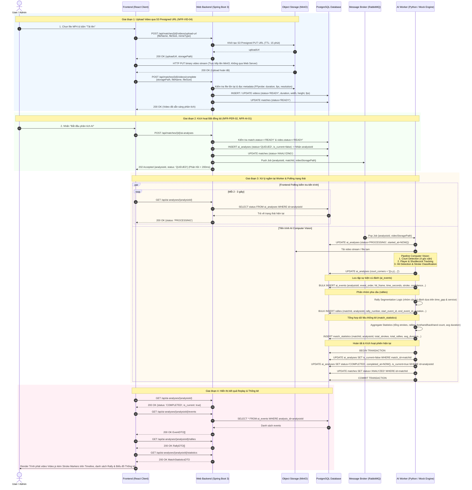
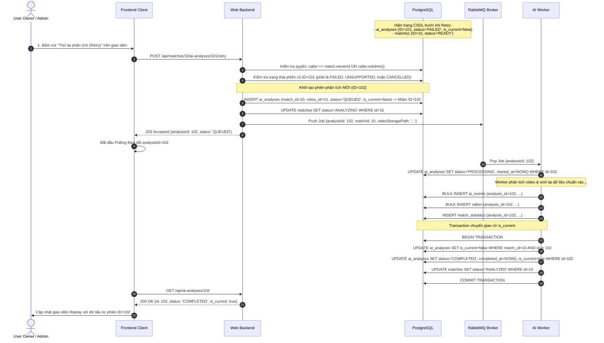
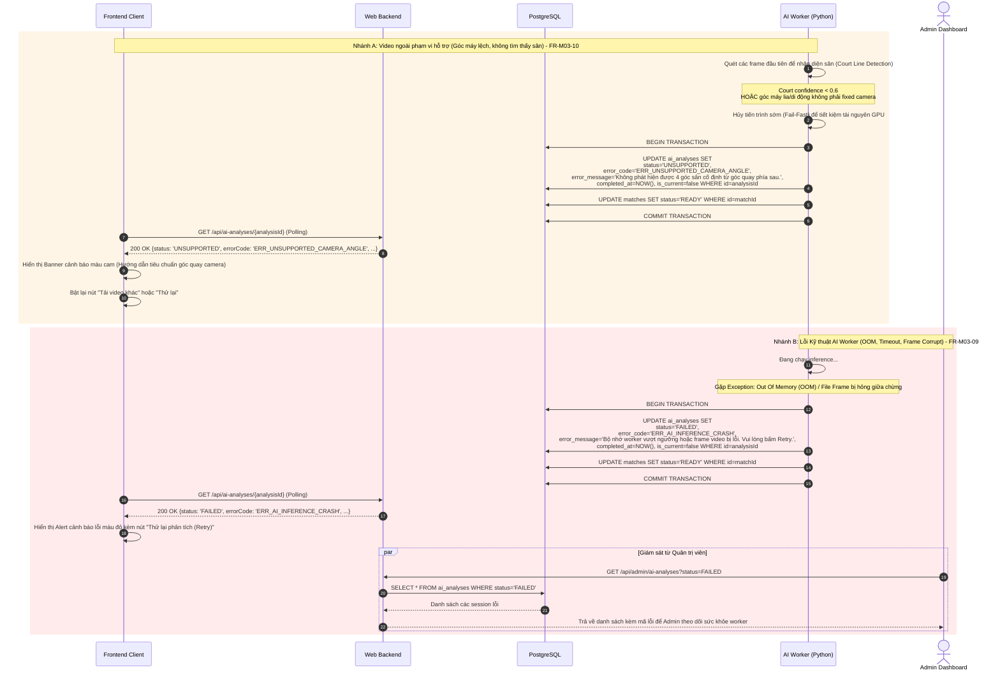

# Thiết kế Biểu Đồ Tuần Tự (Sequence Diagrams Specification)

* **Dự án:** PBL6 Badminton - Match Analysis & Replay Platform
* **Thư mục:** `docs/02-design/`
* **Ngày thiết kế:** 2026-10-08
* **Nội dung:** Chi tiết hóa 3 luồng hoạt động then chốt của hệ thống bằng biểu đồ tuần tự (Mermaid):
  1. Luồng xử lý phân tích hoàn chỉnh từ đầu đến cuối (End-to-End Processing Flow).
  2. Luồng thử lại phân tích (Retry Analysis) và cơ chế chuyển đổi cờ `is_current`.
  3. Luồng xử lý các tình huống lỗi: Video ngoài phạm vi hỗ trợ (FR-M03-10) và Lỗi kỹ thuật AI Worker (FR-M03-09).

---

## 1. Sequence Diagram: Luồng Xử lý Toàn diện từ Upload đến Phân tích

Mô tả chi tiết từ khi người dùng tải video lên MinIO, kiểm tra tính hợp lệ, kích hoạt phiên phân tích bất đồng bộ, trích xuất sự kiện cú đánh, phân nhóm pha cầu và tính toán bảng thống kê trận đấu.

---

## 2. Sequence Diagram: Luồng Thử lại Phân tích (Retry Analysis) & Chuyển đổi `is_current`

Khi một phiên phân tích trước đó bị `FAILED` hoặc `UNSUPPORTED`, người dùng sở hữu trận đấu (User Owner) hoặc Quản trị viên (Admin) có thể bấm **Thử lại (Retry)**. Hệ thống tạo một bản ghi phân tích **mới hoàn toàn** để bảo toàn lịch sử kiểm toán, và chỉ chuyển cờ `is_current = true` khi phiên mới thành công mỹ mãn.

---

## 3. Sequence Diagram: Luồng Xử lý Lỗi (Error Handling Flows)

Hệ thống phân biệt rõ ràng 2 kịch bản lỗi chính:
* **Nhánh A:** Video nằm ngoài phạm vi hỗ trợ của mô hình Computer Vision ([FR-M03-10](file:///d:/DUT/HK1_Nam4_2026-2027/PBL6/PBL6_code/docs/00-requirements/PBL6-Badminton_requirements.md#L49)).
* **Nhánh B:** Lỗi kỹ thuật hạ tầng AI / Worker crash / Timeout ([FR-M03-09](file:///d:/DUT/HK1_Nam4_2026-2027/PBL6/PBL6_code/docs/00-requirements/PBL6-Badminton_requirements.md#L48)).

---

## 4. Bảng Tra cứu Mã Lỗi Chuẩn hóa (Error Code Dictionary)

| Mã Lỗi (`error_code`) | Nhóm Lỗi | Thông điệp hiển thị người dùng (`error_message`) | Hướng dẫn khắc phục |
| :--- | :---: | :--- | :--- |
| `ERR_UNSUPPORTED_CAMERA_ANGLE` | Nghiệp vụ (FR-M03-10) | Không phát hiện được 4 góc sân cố định từ góc quay phía sau sân. | Đảm bảo video được quay từ góc camera tĩnh, đặt chính giữa phía sau vạch cuối sân, nhìn rõ toàn bộ mặt sân. |
| `ERR_VIDEO_RESOLUTION_LOW` | Nghiệp vụ (FR-M03-10) | Độ phân giải video quá thấp (tối thiểu yêu cầu 720p HD). | Vui lòng tải lên video có độ phân giải tối thiểu $1280 \times 720$. |
| `ERR_CORRUPTED_VIDEO_STREAM` | Kỹ thuật (FR-M03-09) | Tệp video bị gián đoạn hoặc hỏng frame trong quá trình giải mã. | Kiểm tra lại file video gốc trên máy tính và tải lên lại. |
| `ERR_AI_TIMEOUT` | Kỹ thuật (FR-M03-09) | Quá thời gian xử lý tối đa (timeout sau 15 phút). | Bấm nút **"Thử lại phân tích (Retry)"** để đưa vào hàng đợi xử lý lại. |
| `ERR_AI_INFERENCE_CRASH` | Kỹ thuật (FR-M03-09) | Lỗi tiến trình suy luận mô hình thị giác máy tính. | Bấm **Retry** hoặc liên hệ Quản trị viên hệ thống để kiểm tra tài nguyên GPU. |

