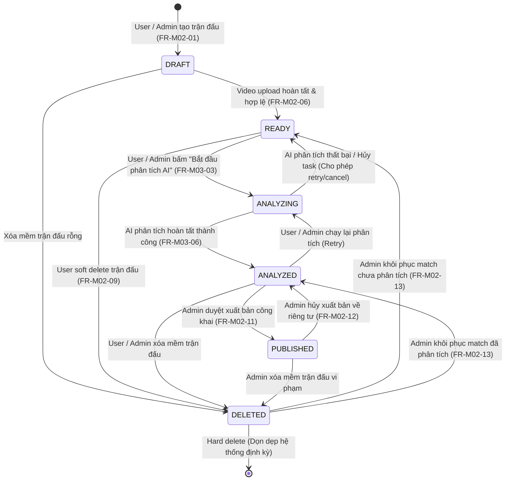
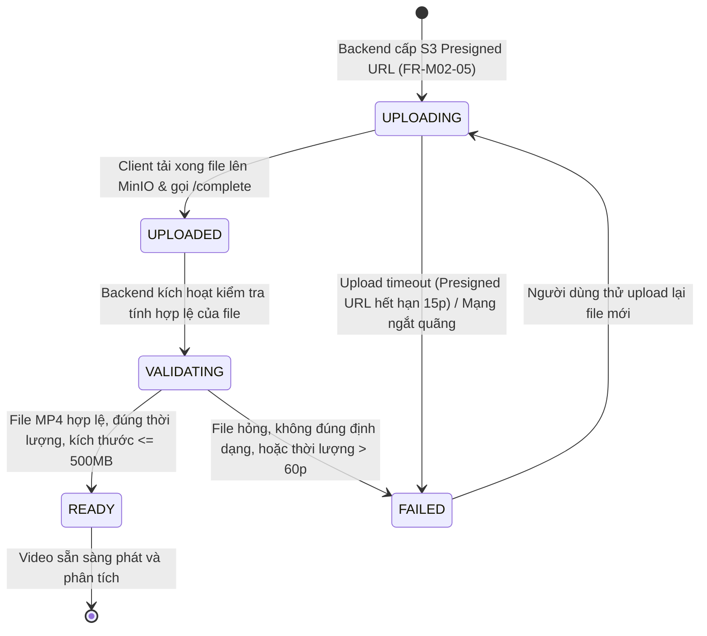
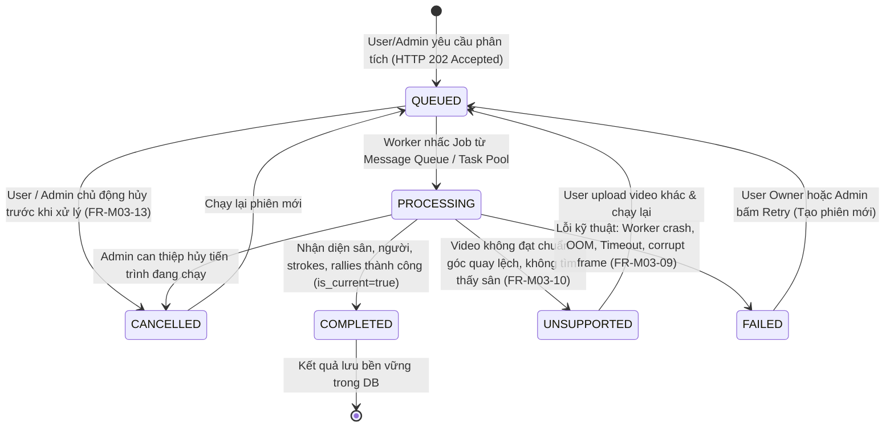

# Thiết kế Máy Trạng Thái (State Machines Specification)

* **Dự án:** PBL6 Badminton - Match Analysis & Replay Platform
* **Thư mục:** `docs/02-design/`
* **Ngày thiết kế:** 2026-10-08
* **Nội dung:** Mô hình hóa vòng đời và các bước chuyển đổi trạng thái của 3 thực thể cốt lõi: `matches`, `videos`, và `ai_analyses`.

---

## 1. State Machine: `matches` (Trận đấu)

Trận đấu trải qua các giai đoạn từ khi tạo khung thông tin (Draft), tiếp nhận video, phân tích AI, đến khi lưu trữ riêng tư hoặc xuất bản công khai.

### Bảng Mô tả Trạng thái `matches`

| Trạng thái | Điều kiện chuyển | Mô tả nghiệp vụ | Quyền truy cập |
| :--- | :--- | :--- | :--- |
| **`DRAFT`** | Khi gọi `POST /api/matches` | Trận đấu mới tạo thông tin metadata, chưa có file video. | Chỉ Owner & Admin |
| **`READY`** | Sau khi video upload và validate xong | Đã có video sẵn sàng trong MinIO, chờ người dùng kích hoạt AI. | Chỉ Owner & Admin |
| **`ANALYZING`** | Khi gọi `POST /api/matches/{id}/ai-analyses` | Hệ thống đang chạy tiến trình phân tích AI (khóa không cho upload video mới). | Chỉ Owner & Admin |
| **`ANALYZED`** | Khi phiên AI đổi sang `COMPLETED` | Đã có kết quả sự kiện, pha cầu và thống kê. Trận đấu ở chế độ **Private**. | Chỉ Owner & Admin |
| **`PUBLISHED`** | Khi Admin gọi `POST /publish` | Trận đấu được công khai trên Thư viện Public Library (M07). | Public (Guest & User) |
| **`DELETED`** | Khi gọi `DELETE /api/matches/{id}` | Trận đấu bị xóa mềm (`deleted_at != NULL`), ẩn khỏi danh sách thông thường. | Chỉ Admin xem/khôi phục |

---

## 2. State Machine: `videos` (File Video Trận đấu)

Mỗi trận đấu gắn với duy nhất 1 video chính (quan hệ 1-1). Video được tải trực tiếp lên MinIO thông qua S3 Presigned URL.

### Bảng Mô tả Trạng thái `videos`

| Trạng thái | Điều kiện kích hoạt | Ý nghĩa kỹ thuật |
| :--- | :--- | :--- |
| **`UPLOADING`** | Backend trả về Presigned URL | Client đang đẩy binary stream trực tiếp lên MinIO bucket `badminton-videos`. |
| **`UPLOADED`** | Client gọi `POST /videos/complete` | Dữ liệu đã nằm trọn vẹn trong MinIO, chờ Backend đọc header metadata. |
| **`VALIDATING`** | Service chạy ngầm | Kiểm tra mime-type (`video/mp4`), đọc kích thước file và thời lượng qua FFprobe/Metadata. |
| **`READY`** | Validate thành công | Video hoàn chỉnh, cập nhật `duration_seconds`, `width`, `height`, `fps`. Sẵn sàng cho Replay và AI. |
| **`FAILED`** | Lỗi định dạng / timeout | Ghi nhận lỗi upload để thông báo người dùng chọn lại file khác. |

---

## 3. State Machine: `ai_analyses` (Phiên Phân tích AI)

Quản lý toàn bộ tiến trình phân tích Computer Vision của một trận đấu, bao gồm các kịch bản thành công, lỗi kỹ thuật, video không hợp lệ và hủy tác vụ.

### Bảng Mô tả Trạng thái `ai_analyses`

| Trạng thái | Mã Trạng thái | Mô tả chi tiết | Cờ `is_current` |
| :--- | :---: | :--- | :---: |
| **`QUEUED`** | Hàng đợi | Yêu cầu đã ghi vào DB, task đã đẩy vào Message Broker (RabbitMQ) hoặc Thread Pool ngầm. | `false` |
| **`PROCESSING`** | Đang xử lý | Worker đang tải video, giải mã frame và chạy các mô hình YOLO / TrackNet. | `false` |
| **`COMPLETED`** | Thành công | Trích xuất thành công toàn bộ strokes, rallies và thống kê. Trận đấu sẵn sàng Replay. | **`true`** |
| **`FAILED`** | Thất bại kỹ thuật | Worker gặp sự cố runtime (Crash, Timeout, Out of Memory, lỗi giải mã frame). Cho phép **Retry**. | `false` |
| **`UNSUPPORTED`** | Ngoài phạm vi | AI không nhận diện được 4 góc sân (`court_corners`) hoặc góc máy quay không đúng chuẩn cố định từ phía sau sân. | `false` |
| **`CANCELLED`** | Đã hủy | Phiên bị dừng bởi yêu cầu của người dùng hoặc quản trị viên khi đang đợi hoặc đang chạy. | `false` |

---

## 4. Ma trận Ràng buộc Tương quan Trạng thái (State Correlation Matrix)

Hệ thống đảm bảo tính nhất quán dữ liệu giữa 3 thực thể thông qua ma trận ràng buộc sau:

| Trạng thái `matches` | Trạng thái `videos` bắt buộc | Trạng thái `ai_analyses` (phiên active nhất) | Hành vi giao diện người dùng (UI Behavior) |
| :---: | :---: | :---: | :--- |
| **`DRAFT`** | Không có hoặc `UPLOADING` | Chưa có | Hiển thị nút/khung tải lên Video trận đấu. |
| **`READY`** | `READY` | Chưa có hoặc `FAILED` / `UNSUPPORTED` | Hiển thị nút **"Bắt đầu phân tích AI"** (hoặc nút **"Thử lại"** nếu phiên trước lỗi). |
| **`ANALYZING`** | `READY` | `QUEUED` hoặc `PROCESSING` | Khóa nút phân tích; hiển thị thanh tiến trình (Progress Bar & Spinner) tự động Polling. |
| **`ANALYZED`** | `READY` | `COMPLETED` (`is_current = true`) | Mở toàn bộ tính năng: Replay Video, Markers, Rallies, Thống kê (Chế độ riêng tư). |
| **`PUBLISHED`** | `READY` | `COMPLETED` (`is_current = true`) | Xuất hiện trên trang chủ Public Library; Khách được xem preview 5 phút, User xem full. |
| **`DELETED`** | Bất kỳ | Giữ nguyên | Trận đấu bị ẩn trong thùng rác; chỉ Admin mới có quyền xem và khôi phục. |

