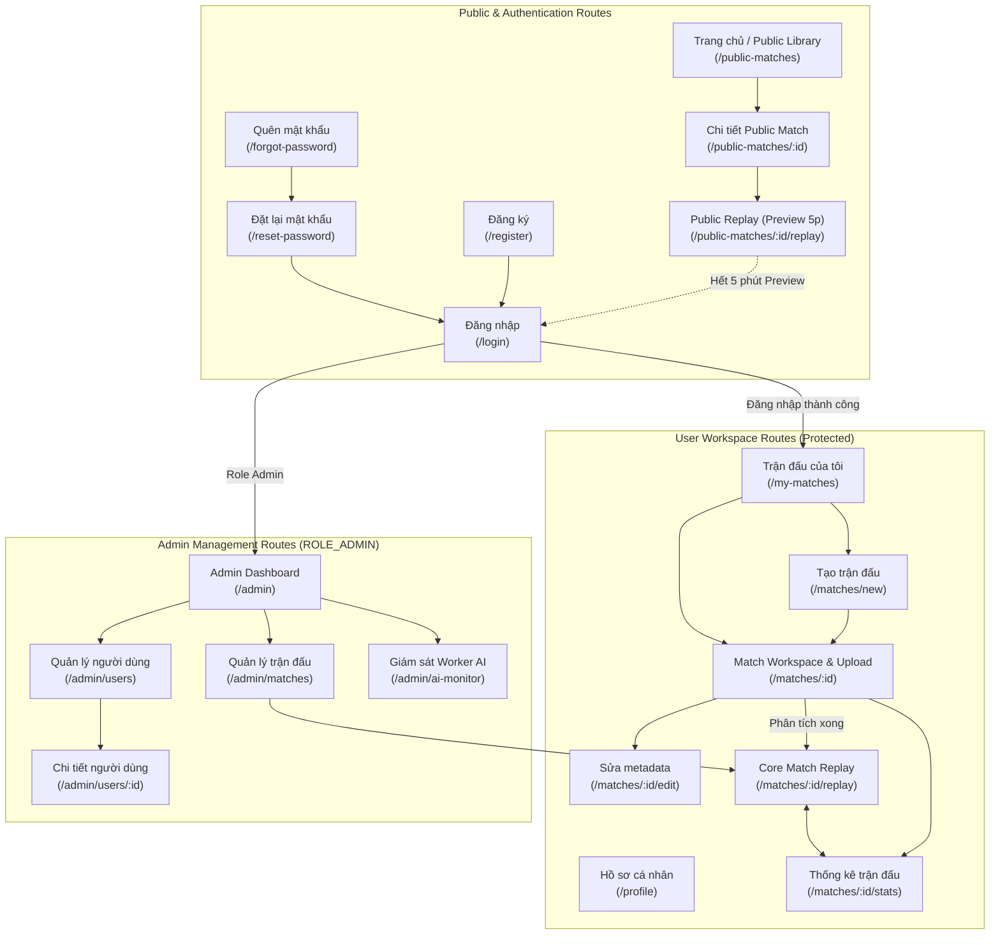
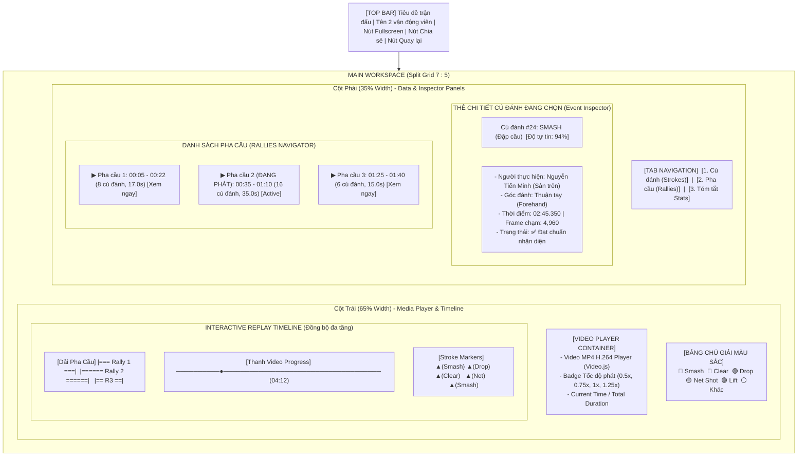

# Thiết kế Giao Diện Người Dùng, Sitemap & Wireframes (UI/UX Specification)

* **Dự án:** PBL6 Badminton - Match Analysis & Replay Platform
* **Thư mục:** `docs/02-design/`
* **Ngày thiết kế:** 2026-10-08
* **Nội dung:** 
  1. Phân loại danh sách toàn bộ màn hình theo 3 Role (**Guest**, **User**, **Admin**).
  2. Sơ đồ điều hướng (Sitemap) bằng Mermaid.
  3. Wireframe chi tiết (đặc biệt chuyên sâu cho màn hình cốt lõi **Match Replay**).
  4. Bảng tra cứu ánh xạ: **Màn hình $\rightarrow$ API sử dụng $\rightarrow$ FR-ID**.

---

## 1. Danh Sách Toàn Bộ Màn Hình Phân Loại Theo Role

### 1.1. Nhóm Màn hình cho Khách vãng lai (Guest)
* **SCR-G01 (Public Library):** Trang chủ & Thư viện trận đấu công khai (`/` hoặc `/public-matches`).
* **SCR-G02 (Public Match Detail):** Xem tóm tắt thông tin trận đấu công khai (`/public-matches/:id`).
* **SCR-G03 (Public Replay Preview):** Xem lại video trận đấu công khai kèm timeline markers — **giới hạn xem thử tối đa 5 phút** (`/public-matches/:id/replay`).
* **SCR-G04 (Register):** Màn hình Đăng ký tài khoản (`/register`).
* **SCR-G05 (Login):** Màn hình Đăng nhập hệ thống (`/login`).
* **SCR-G06 (Forgot Password):** Màn hình Yêu cầu gửi Magic Reset Link (`/forgot-password`).
* **SCR-G07 (Reset Password):** Màn hình Đặt lại mật khẩu mới qua Token (`/reset-password?token=...`).

### 1.2. Nhóm Màn hình cho Người dùng đã đăng nhập (User - ROLE_USER)
* Bao gồm toàn bộ màn hình của Guest (được xem video Replay không giới hạn thời lượng).
* **SCR-U01 (User Profile):** Hồ sơ cá nhân, cập nhật avatar và trình độ cầu lông (`/profile`).
* **SCR-U02 (My Matches List):** Quản lý danh sách trận đấu do mình tạo (`/my-matches`).
* **SCR-U03 (Create Match):** Tạo mới trận đấu (nhập Player A/B, vị trí sân) (`/matches/new`).
* **SCR-U04 (Match Workspace / Detail):** Chi tiết trận đấu, Upload video qua MinIO Presigned URL, Theo dõi tiến trình AI (`/matches/:id`).
* **SCR-U05 (Edit Match):** Chỉnh sửa thông tin metadata trận đấu (`/matches/:id/edit`).
* **SCR-U06 (Core Match Replay):** Màn hình Phân tích & Xem lại trận đấu chuyên sâu (`/matches/:id/replay`).
* **SCR-U07 (Match Statistics):** Bảng dashboard thống kê toàn diện trận đấu (`/matches/:id/stats`).

### 1.3. Nhóm Màn hình cho Quản trị viên (Admin - ROLE_ADMIN)
* **SCR-A01 (Admin Dashboard):** Bảng tổng quan hệ thống, thống kê số users, matches, tải worker (`/admin`).
* **SCR-A02 (Admin User Management):** Quản lý người dùng, khóa / mở khóa tài khoản (`/admin/users`).
* **SCR-A03 (Admin User Detail):** Chi tiết người dùng và lịch sử trận đấu (`/admin/users/:id`).
* **SCR-A04 (Admin Match Management):** Quản lý toàn bộ trận đấu, duyệt xuất bản / hủy xuất bản, xóa mềm & khôi phục (`/admin/matches`).
* **SCR-A05 (Admin AI Monitor):** Giám sát hàng đợi phân tích AI, danh sách lỗi và retry khẩn cấp (`/admin/ai-monitor`).

---

## 2. Sơ Đồ Điều Hướng Ứng Dụng (Sitemap)



---

## 3. Wireframe Chi Tiết Màn Hình Cốt Lõi: Match Replay (`SCR-U06` / `SCR-G03`)

Màn hình **Match Replay** là tính năng trung tâm của hệ thống, tích hợp đồng bộ:
1. Trình phát video Video.js.
2. Dòng thời gian Timeline đa tầng (thanh tiến trình + markers cú đánh phân màu + dải phân đoạn pha cầu).
3. Panel hiển thị thông số cú đánh đang chọn (Inspector Card).
4. Tab phân tích chuỗi pha cầu (Rallies Navigator).
5. Modal giới hạn xem thử 5 phút dành cho Khách vãng lai (Guest Preview Modal).

### 3.1. Sơ Đồ Bố Cục Layout (Mermaid Layout)



---

### 3.2. Bản Vẽ Giao Diện Chi Tiết Dạng Text Wireframe (ASCII Wireframe)

```text
+-----------------------------------------------------------------------------------------------------------------------+
|  <- Trận đấu của tôi   |   Nguyễn Tiến Minh (Sân trên)  VS  Lee Chong Wei (Sân dưới)         | [1080p] [Tốc độ: 1.0x] |
+-----------------------------------------------------------------------------------------------------------------------+
|                                                           |  [ Cú đánh (48) ]  |  [ Pha cầu (6) ]* |  [ Thống kê tóm tắt ]    |
|   +---------------------------------------------------+   |-----------------------------------------------------------|
|   |                                                   |   |  THÔNG TIN CÚ ĐÁNH ĐANG CHỌN (Event Inspector):           |
|   |                                                   |   |  +-----------------------------------------------------+  |
|   |                 VIDEO PLAYER AREA                 |   |  |  Cú đánh #18: SMASH (Đập cầu)              [94.5%]  |  |
|   |                                                   |   |  |  -------------------------------------------------  |  |
|   |               (Video.js Stream Engine)            |   |  |  - Vận động viên : Nguyễn Tiến Minh (Upper Player)  |  |
|   |                                                   |   |  |  - Kiểu vung vợt : Thuận tay (Forehand)             |  |
|   |                                                   |   |  |  - Thời điểm     : 01:14.250 (Frame chạm: 2,227)    |  |
|   |                                                   |   |  |  - Khung chuẩn bị: Frame 2,210 -> Kết thúc: 2,245   |  |
|   |                                                   |   |  +-----------------------------------------------------+  |
|   |  [Play]  01:14 / 23:45                 [Loa] [[]] |   |                                                           |
|   +---------------------------------------------------+   |  DANH SÁCH PHA CẦU (Click để nhảy video đến pha cầu):     |
|                                                           |  +-----------------------------------------------------+  |
|   === DẢI PHA CẦU TRÊN VIDEO (Rally Intervals): ========= |  |  Pha 1: 00:08 - 00:24 (17.5s, 8 cú đánh)   [Xem]    |  |
|   [=== Rally 1 ===]        [======= Rally 2 (Active) ======]  |  |-----------------------------------------------------|  |
|                                                           |  |  Pha 2 (ĐANG PHÁT): 01:05 - 01:38 (33.0s, 14 cú)  |  |
|   === THANH TIẾN TRÌNH VIDEO (Time Seeker): ============= |  |  Chuỗi cú đánh: Serve -> Clear -> Drop -> [Smash*]  |  |
|   ------------|------------------------------------------ |  |-----------------------------------------------------|  |
|              01:14                                        |  |  Pha 3: 02:10 - 02:22 (12.0s, 6 cú đánh)   [Xem]    |  |
|   === DÒNG SỰ KIỆN CÚ ĐÁNH (Stroke Pins): ================|  |  Pha 4: 03:05 - 03:40 (35.0s, 18 cú đánh)  [Xem]    |  |
|         🔴   🔵    🟢   🟡       🔴*         🔵    🟢     |  |  Pha 5: 04:12 - 04:30 (18.0s, 9 cú đánh)   [Xem]    |  |
|                                                           |  +-----------------------------------------------------+  |
|   Chú giải:  🔴 Smash   🔵 Clear   🟢 Drop   🟡 Net   ⚪ Khác |  [<< Cú trước]               [Cú kế tiếp >>] [Tự động lặp lại] |
+-----------------------------------------------------------------------------------------------------------------------+
```

---

### 3.3. Wireframe Modal Giới Hạn 5 Phút Xem Thử Cho Khách (Guest Preview Limit Modal)

Khi khách vãng lai xem đến giây thứ **300 (05:00)** của trận đấu công khai, video tự động dừng và màn hình xuất hiện Modal khóa:

```text
+-----------------------------------------------------------------------+
|                           THÔNG BÁO XEM THỬ                           |
+-----------------------------------------------------------------------+
|                                                                       |
|         🔒 BẠN ĐÃ XEM HẾT 5 PHÚT PREVIEW DÙNG THỬ CÔNG KHAI!          |
|                                                                       |
|   Bạn đang xem trận đấu ở chế độ Khách vãng lai (Guest).             |
|   Để tiếp tục theo dõi trọn vẹn toàn bộ trận đấu, đồng bộ dòng sự kiện|
|   cú đánh và xem toàn bộ thống kê chi tiết, vui lòng Đăng nhập.       |
|                                                                       |
|            [ Đăng Nhập Ngay ]          [ Tạo Tài Khoản Mới ]         |
|                                                                       |
|                       [ Tiếp tục xem từ đầu (5p) ]                   |
+-----------------------------------------------------------------------+
```

---

## 4. Wireframe Màn Hình Quản Lý Trận Đấu & Upload Video (`SCR-U04`)

Màn hình nơi người dùng tải file video lớn lên MinIO qua S3 Presigned URL và khởi chạy tiến trình phân tích AI.

```text
+-----------------------------------------------------------------------------------------------------------------------+
|  Chi tiết trận đấu: Chung kết Đơn nam Giải Cầu lông 2026                 [Trạng thái: READY] [Chỉnh sửa] [Xóa trận]   |
+-----------------------------------------------------------------------------------------------------------------------+
|  THÔNG TIN CƠ BẢN:                                                                                                    |
|  - Vận động viên: Nguyễn Tiến Minh (Sân trên) VS Lee Chong Wei (Sân dưới)                                            |
|  - Ngày thi đấu: 08/10/2026   |  Nguồn: Người dùng tải lên (USER_UPLOAD)                                             |
|-----------------------------------------------------------------------------------------------------------------------|
|  VIDEO TRẬN ĐẤU:                                                                                                      |
|  +-----------------------------------------------------------------------------------------------------------------+  |
|  |  [Icon Video] match_final_game1.mp4 (245 MB) - Thời lượng: 34 phút 20 giây - Độ phân giải: 1920x1080 (30 fps)     |  |
|  |  Trạng thái: ✅ Video đã sẵn sàng trên MinIO Storage                                                             |  |
|  +-----------------------------------------------------------------------------------------------------------------+  |
|-----------------------------------------------------------------------------------------------------------------------|
|  TIẾN TRÌNH PHÂN TÍCH AI:                                                                                             |
|  Trạng thái hiện tại: 🟡 ĐANG XỬ LÝ (PROCESSING)                                                                     |
|  [========================================>                          ]  65% (Đang nhận diện cú đánh frame 34,200)     |
|                                                                                                                       |
|  [ Bắt đầu phân tích AI ] (Disabled)     [ Hủy tiến trình ]     [ Xem kết quả Replay ] (Sẽ mở khi hoàn tất)           |
+-----------------------------------------------------------------------------------------------------------------------+
```

---

## 5. Bảng Mapping Toàn Bộ Màn Hình $\rightarrow$ API Sử Dụng $\rightarrow$ FR-ID

Bảng ánh xạ hoàn chỉnh 3 chiều giữa Giao diện người dùng (Screens), Giao diện lập trình (API Endpoints) và Yêu cầu nghiệp vụ (FR):

| Mã Màn hình | Tên Màn hình & Đường dẫn | Role Cho phép | API Endpoint sử dụng | Phương thức | FR-ID Ánh xạ |
| :---: | :--- | :---: | :--- | :---: | :--- |
| **SCR-G01** | Public Match Library (`/public-matches`) | Guest / User / Admin | `/api/public-matches` | `GET` | FR-M07-01 $\rightarrow$ FR-M07-05 |
| **SCR-G02** | Public Match Detail (`/public-matches/:id`) | Guest / User / Admin | `/api/public-matches/{id}` | `GET` | FR-M07-06 |
| **SCR-G03** | Public Replay Preview (`/public-matches/:id/replay`) | **Guest (Preview $\le 5\text{p}$)** / User | `/api/videos/{id}/stream`<br>`/api/ai-analyses/{id}/events`<br>`/api/ai-analyses/{id}/rallies`<br>`/api/ai-analyses/{id}/statistics` | `GET` | FR-M07-07, FR-M04-01 $\rightarrow$ FR-M04-07, FR-M05-05, FR-M06-09 |
| **SCR-G04** | Đăng ký tài khoản (`/register`) | Guest | `/api/auth/register` | `POST` | FR-M01-01 |
| **SCR-G05** | Đăng nhập (`/login`) | Guest | `/api/auth/login` | `POST` | FR-M01-02 |
| **SCR-G06** | Quên mật khẩu (`/forgot-password`) | Guest | `/api/auth/forgot-password` | `POST` | FR-M01-06 |
| **SCR-G07** | Đặt lại mật khẩu (`/reset-password`) | Guest | `/api/auth/reset-password` | `POST` | FR-M01-07 |
| **SCR-U01** | Profile cá nhân (`/profile`) | User / Admin | `/api/users/me`<br>`/api/users/me/avatar` | `GET`, `PUT`<br>`POST` | FR-M01-04, FR-M01-05 |
| **SCR-U02** | Trận đấu của tôi (`/my-matches`) | User / Admin | `/api/matches`<br>`/api/matches/{id}` | `GET`<br>`DELETE` | FR-M02-07, FR-M02-09 |
| **SCR-U03** | Tạo trận đấu mới (`/matches/new`) | User / Admin | `/api/matches` | `POST` | FR-M02-01, FR-M02-03 |
| **SCR-U04** | Match Workspace & Upload (`/matches/:id`) | User Owner / Admin | `/api/matches/{id}`<br>`/api/matches/{id}/videos/upload-url`<br>`/api/matches/{id}/videos/complete`<br>`/api/matches/{id}/ai-analyses`<br>`/api/ai-analyses/{id}` | `GET`<br>`POST`<br>`POST`<br>`POST`<br>`GET` | FR-M02-05, FR-M02-06, FR-M02-08, FR-M03-01 $\rightarrow$ FR-M03-05 |
| **SCR-U05** | Chỉnh sửa trận đấu (`/matches/:id/edit`) | User Owner / Admin | `/api/matches/{id}` | `GET`, `PUT` | FR-M02-04 |
| **SCR-U06** | **Core Match Replay (`/matches/:id/replay`)** | User Owner / Admin | `/api/videos/{id}/stream`<br>`/api/ai-analyses/{id}/events`<br>`/api/ai-analyses/{id}/rallies`<br>`/api/rallies/{id}`<br>`/api/matches/{id}/ai-analyses/{aid}/retry`<br>`/api/matches/{id}/ai-analyses/{aid}/cancel` | `GET`<br>`GET`<br>`GET`<br>`GET`<br>`POST`<br>`POST` | **FR-M04-01 $\rightarrow$ FR-M04-07**,<br>**FR-M05-01 $\rightarrow$ FR-M05-09**,<br>**FR-M03-11 $\rightarrow$ FR-M03-13** |
| **SCR-U07** | Thống kê trận đấu (`/matches/:id/stats`) | User Owner / Admin | `/api/ai-analyses/{id}/statistics` | `GET` | FR-M06-01 $\rightarrow$ FR-M06-13 |
| **SCR-A01** | Admin Dashboard (`/admin`) | Admin | `/api/admin/dashboard` | `GET` | FR-M08-01 |
| **SCR-A02** | Admin Quản lý User (`/admin/users`) | Admin | `/api/admin/users`<br>`/api/admin/users/{id}/status` | `GET`<br>`PUT` | FR-M08-02, FR-M08-04 |
| **SCR-A03** | Admin Chi tiết User (`/admin/users/:id`) | Admin | `/api/admin/users/{id}` | `GET` | FR-M08-03 |
| **SCR-A04** | Admin Quản lý Match (`/admin/matches`) | Admin | `/api/admin/matches`<br>`/api/admin/matches/{id}/publish`<br>`/api/admin/matches/{id}/unpublish`<br>`/api/admin/matches/{id}`<br>`/api/admin/matches/{id}/restore` | `GET`<br>`POST`<br>`POST`<br>`DELETE`<br>`POST` | FR-M08-05, FR-M08-08 $\rightarrow$ FR-M08-10 |
| **SCR-A05** | Admin Giám sát AI (`/admin/ai-monitor`) | Admin | `/api/admin/ai-analyses`<br>`/api/admin/ai-analyses/{id}/retry` | `GET`<br>`POST` | FR-M08-06, FR-M08-07, FR-M08-11 |

---

## 6. Tổng Kết

Tài liệu thiết kế giao diện đã chuẩn hóa:
1. **Phân quyền giao diện rõ ràng:** Đảm bảo khách vãng lai chỉ tiếp cận được các luồng công khai và bị giới hạn xem thử 5 phút trên video.
2. **Trải nghiệm Replay đỉnh cao:** Đồng bộ 3 luồng dữ liệu thời gian thực (Video playback $\leftrightarrow$ Stroke timeline markers $\leftrightarrow$ Danh sách Rally đang phát).
3. **Tính truy vết 100%:** Mọi thành phần trên giao diện đều có API tương ứng và giải quyết cụ thể các yêu cầu chức năng (FR) trong đặc tả ban đầu.

