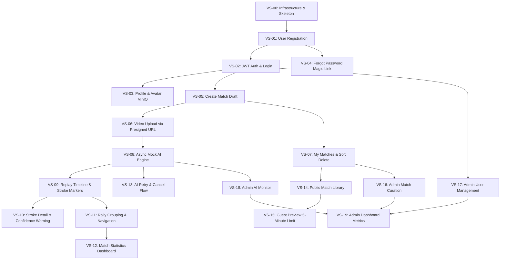

# Product Backlog & Kế hoạch Triển khai Vertical Slices (PBL6 Badminton)

* **Dự án:** PBL6 - Nền tảng Phân tích Video Cầu lông & Xem lại Trận đấu
* **Mô hình triển khai:** **Vertical Slices** (Lát cắt chức năng dọc xuyên suốt DB $\rightarrow$ Backend $\rightarrow$ Frontend).
* **Quy chuẩn thời gian:** Mỗi slice được thiết kế tinh gọn để hoàn thành trong **1 – 3 giờ**.
* **Định dạng Acceptance Criteria:** Chuẩn **Given / When / Then** (Gherkin format).
* **Phân loại độ ưu tiên:** **Must** (Bắt buộc cho MVP), **Should** (Nên có), **Could** (Nâng cao/Tạm hoãn).

---

## 🗺️ Bản đồ Lộ trình & Phụ thuộc (Dependency Graph)



---

## Giai đoạn 0: Hạ tầng & Khởi tạo Khung Dự án (Foundation)

### [VS-00] Hạ tầng Môi trường Local & Skeleton Dự án
* **Độ ưu tiên:** **Must**
* **Ước lượng:** 2.5 giờ
* **Phụ thuộc:** Không có (Bắt đầu dự án)
* **Phạm vi kỹ thuật:**
  * **DevOps:** Thiết lập `docker-compose.yml` gồm **PostgreSQL 15** (port 5432) và **MinIO** (port 9000 API, 9001 Console) kèm script tự tạo bucket `badminton-videos` và `badminton-avatars`.
  * **Backend:** Khởi tạo Spring Boot 3 (Java 17/21), tích hợp Flyway/Liquibase migration, cấu hình kết nối PostgreSQL và Spring Web.
  * **Frontend:** Khởi tạo React 18 + Vite + TypeScript + TailwindCSS, cấu hình React Router DOM và Axios client cơ bản.
* **Acceptance Criteria:**
  ```gherkin
  Scenario: Chạy toàn bộ hệ thống nền tảng local thành công
    Given file docker-compose.yml đã được cấu hình đúng cổng và credentials
    When developer thực thi lệnh docker compose up -d
    Then container PostgreSQL và MinIO khởi động ở trạng thái Healthy
    And backend Spring Boot kết nối thành công tới Database và log Started Application
    And frontend React hiển thị trang chào mừng tại http://localhost:5173
  ```

---

## Giai đoạn 1: Xác thực & Quản lý Tài khoản (M01)

### [VS-01] Đăng ký Tài khoản Người dùng (Registration)
* **Độ ưu tiên:** **Must**
* **Ước lượng:** 1.5 giờ
* **Phụ thuộc:** `VS-00`
* **Phạm vi kỹ thuật:**
  * **DB:** Bảng `users` (id, email, password_hash, role, status, created_at).
  * **Backend:** `POST /api/auth/register`, mã hóa mật khẩu bằng BCrypt, validate email hợp lệ và mật khẩu tối thiểu 8 ký tự.
  * **Frontend:** Trang `/register` với form Email, Password, Họ tên; hiển thị lỗi validate và thông báo thành công chuyển sang Login.
* **Acceptance Criteria:**
  ```gherkin
  Scenario: Đăng ký tài khoản thành công
    Given người dùng ở trang /register và email "user@example.com" chưa tồn tại trong hệ thống
    When người dùng nhập đúng thông tin và nhấn "Đăng ký"
    Then API trả về mã 201 Created kèm thông tin UserDTO (không lộ password)
    And bản ghi mới được lưu trong DB với role='ROLE_USER' và status='ACTIVE'
    And giao diện hiển thị thông báo thành công và chuyển hướng đến trang /login

  Scenario: Đăng ký thất bại do email đã tồn tại
    Given email "user@example.com" đã tồn tại trong DB
    When người dùng cố gắng đăng ký với email này
    Then API trả về mã 409 Conflict với error message "Email đã được sử dụng"
    And form hiển thị thông báo lỗi màu đỏ tại ô email
  ```

---

### [VS-02] Đăng nhập & Xác thực JWT (Access & Refresh Token)
* **Độ ưu tiên:** **Must**
* **Ước lượng:** 2.5 giờ
* **Phụ thuộc:** `VS-01`
* **Phạm vi kỹ thuật:**
  * **Backend:** Cấu hình Spring Security Filter Chain, `POST /api/auth/login`, cấp Access Token (30 phút) và Refresh Token (7 ngày), `POST /api/auth/refresh-token`, `POST /api/auth/logout`.
  * **Frontend:** Trang `/login`, lưu token, cấu hình Axios Interceptor tự động gắn `Authorization: Bearer <token>` vào request và tự refresh token khi nhận 401.
* **Acceptance Criteria:**
  ```gherkin
  Scenario: Đăng nhập thành công với thông tin chính xác
    Given tài khoản "user@example.com" đang ở trạng thái ACTIVE
    When người dùng nhập đúng email, mật khẩu tại /login và nhấn "Đăng nhập"
    Then API trả về 200 OK kèm accessToken, refreshToken và UserDTO
    And frontend lưu token vào bộ nhớ an toàn và chuyển hướng về trang chủ
    And thanh Navigation hiển thị tên người dùng và avatar mặc định

  Scenario: Đăng nhập thất bại do tài khoản bị khóa
    Given tài khoản "baduser@example.com" có status='LOCKED'
    When người dùng đăng nhập bằng tài khoản này
    Then API trả về mã 403 Forbidden với message "Tài khoản của bạn đã bị khóa"
    And giao diện hiển thị cảnh báo từ chối truy cập
  ```

---

### [VS-03] Xem Profile Cá nhân & Upload Avatar lên MinIO
* **Độ ưu tiên:** **Must**
* **Ước lượng:** 2.0 giờ
* **Phụ thuộc:** `VS-02`
* **Phạm vi kỹ thuật:**
  * **Backend:** `GET /api/users/me`, `PUT /api/users/me` (sửa tên, tuổi, giới tính, level), `POST /api/users/me/avatar` (nhận MultipartFile, upload lên bucket `badminton-avatars`, cập nhật `avatar_url`).
  * **Frontend:** Trang `/profile` hiển thị thông tin, component chọn file ảnh xem trước (preview) và nút tải lên, form cập nhật trình độ cầu lông.
* **Acceptance Criteria:**
  ```gherkin
  Scenario: Cập nhật thông tin profile và avatar thành công
    Given người dùng đã đăng nhập và đang ở trang /profile
    When người dùng chọn 1 file ảnh hợp lệ (.jpg/.png < 2MB) và nhấn "Cập nhật ảnh đại diện"
    Then API lưu ảnh vào MinIO, cập nhật avatar_url trong bảng users và trả về 200 OK
    And avatar mới hiển thị ngay lập tức trên trang profile và góc phải Header
  ```

---

### [VS-04] Quên Mật khẩu bằng Magic Reset Link
* **Độ ưu tiên:** **Must**
* **Ước lượng:** 2.0 giờ
* **Phụ thuộc:** `VS-01`
* **Phạm vi kỹ thuật:**
  * **DB:** Bảng `password_resets` (id, user_id, token_hash, expires_at, is_used).
  * **Backend:** `POST /api/auth/forgot-password` (tạo token 15p, in link reset ra log console/mô phỏng email), `POST /api/auth/reset-password` (kiểm tra token, băm mật khẩu mới).
  * **Frontend:** Trang `/forgot-password` (nhập email) và trang `/reset-password?token=...` (nhập mật khẩu mới).
* **Acceptance Criteria:**
  ```gherkin
  Scenario: Đặt lại mật khẩu thành công bằng token hợp lệ
    Given token reset hợp lệ còn hạn trong vòng 15 phút và chưa sử dụng (is_used=false)
    When người dùng truy cập /reset-password?token=XYZ, nhập mật khẩu mới và bấm xác nhận
    Then API cập nhật password_hash mới trong bảng users, đặt is_used=true trong password_resets
    And giao diện thông báo đổi mật khẩu thành công và điều hướng sang /login
  ```

---

## Giai đoạn 2: Quản lý Trận đấu & Upload Video (M02)

### [VS-05] Tạo Trận đấu Mới & Form Nhập Metadata
* **Độ ưu tiên:** **Must**
* **Ước lượng:** 2.0 giờ
* **Phụ thuộc:** `VS-02`
* **Phạm vi kỹ thuật:**
  * **DB:** Bảng `matches` (id, owner_id, player_a_name, player_b_name, upper_player, lower_player, match_date, title, description, source, status, deleted_at).
  * **Backend:** `POST /api/matches`, `GET /api/matches/{id}`, `PUT /api/matches/{id}`.
  * **Frontend:** Modal/Trang `/matches/create` với form nhập tên 2 người chơi, chọn người đứng sân trên/dưới camera, ngày đấu; tạo xong chuyển đến trang chi tiết trận đấu (`/matches/{id}`).
* **Acceptance Criteria:**
  ```gherkin
  Scenario: Người dùng tạo thành công trận đấu ở trạng thái DRAFT
    Given người dùng đã đăng nhập
    When người dùng nhập Player A="Nguyễn Văn A", Player B="Trần Văn B", Upper Player="PLAYER_A" và bấm "Tạo trận đấu"
    Then API tạo bản ghi match mới với owner_id của người dùng, status='DRAFT' và trả về 201 Created
    And frontend chuyển hướng người dùng sang trang /matches/{id} với bước tiếp theo là upload video
  ```

---

### [VS-06] Upload Video Trực tiếp lên MinIO bằng S3 Presigned URL
* **Độ ưu tiên:** **Must**
* **Ước lượng:** 3.0 giờ
* **Phụ thuộc:** `VS-05`
* **Phạm vi kỹ thuật:**
  * **DB:** Bảng `videos` (id, match_id UNIQUE, file_name, storage_path, mime_type, file_size, duration_seconds, status).
  * **Backend:** `POST /api/matches/{id}/videos/upload-url` (sinh presigned URL từ MinIO Client), `POST /api/matches/{id}/videos/complete` (kiểm tra file trên MinIO, lưu metadata, cập nhật `videos.status = READY`, `matches.status = READY`).
  * **Frontend:** Component `VideoDropzoneUploader` tại `/matches/{id}`, xin URL $\rightarrow$ dùng Axios PUT đẩy video trực tiếp lên MinIO kèm thanh tiến trình upload `%` $\rightarrow$ gọi complete.
* **Acceptance Criteria:**
  ```gherkin
  Scenario: Upload video thành công qua Presigned URL mà không làm nghẽn Spring Boot
    Given trận đấu ID=10 đang ở trạng thái DRAFT và chưa có video
    When người dùng chọn file video "final_match.mp4" (200MB) để upload
    Then frontend nhận Presigned URL từ backend và tải trực tiếp dữ liệu lên MinIO
    And thanh tiến trình hiển thị từ 0% đến 100%
    And sau khi xong, frontend gọi /complete để chuyển status video và match sang 'READY'
    And giao diện hiển thị thông tin video sẵn sàng cho bước phân tích AI
  ```

---

### [VS-07] Danh sách Trận đấu của Tôi & Xóa Mềm (Soft Delete)
* **Độ ưu tiên:** **Must**
* **Ước lượng:** 2.0 giờ
* **Phụ thuộc:** `VS-05`
* **Phạm vi kỹ thuật:**
  * **Backend:** `GET /api/matches?page=0&size=10` (lọc theo `owner_id` và `deleted_at IS NULL`), `DELETE /api/matches/{id}` (kiểm tra quyền Owner, đặt `deleted_at = NOW()`).
  * **Frontend:** Trang `/my-matches` danh sách thẻ trận đấu kèm badge trạng thái (`DRAFT`, `READY`, `ANALYZING`, `ANALYZED`), nút phân trang, nút "Xóa" kèm modal xác nhận.
* **Acceptance Criteria:**
  ```gherkin
  Scenario: Xóa mềm trận đấu thành công
    Given người dùng đang xem danh sách trận đấu tại /my-matches
    When người dùng nhấn nút "Xóa" tại trận đấu ID=10 và xác nhận trong modal
    Then API thực thi soft delete, cập nhật deleted_at trong DB và trả về 200 OK
    And trận đấu ID=10 biến mất khỏi danh sách /my-matches của người dùng
    And bản ghi vẫn tồn tại trong CSDL để phục vụ kiểm toán và khôi phục của Admin
  ```

---

## Giai đoạn 3: Phân tích Video AI Bất đồng bộ (M03)

### [VS-08] Kích hoạt Phân tích AI & Bộ máy Giả lập Bất đồng bộ (Mock Engine)
* **Độ ưu tiên:** **Must**
* **Ước lượng:** 2.5 giờ
* **Phụ thuộc:** `VS-06`
* **Phạm vi kỹ thuật:**
  * **DB:** Bảng `ai_analyses` (id, match_id, video_id, status, is_current, started_at, completed_at, court_corners).
  * **Backend:** `POST /api/matches/{id}/ai-analyses` (phản hồi tức thì `202 Accepted` với `QUEUED`), `MockAsyncAnalysisService` dùng `@Async` chạy ngầm (chuyển sang `PROCESSING` sau 2s, giả lập xử lý 6s rồi chuyển sang `COMPLETED`), `GET /api/ai-analyses/{id}`.
  * **Frontend:** Nút "Bắt đầu phân tích AI", Polling hook mỗi 2s tra cứu status, hiển thị thanh tiến trình xử lý từ `QUEUED` $\rightarrow$ `PROCESSING` $\rightarrow$ `COMPLETED`.
* **Acceptance Criteria:**
  ```gherkin
  Scenario: Kích hoạt phân tích AI không block luồng HTTP và cập nhật trạng thái ngầm
    Given trận đấu ID=10 đã có video ở trạng thái READY
    When người dùng nhấn nút "Bắt đầu phân tích AI"
    Then API trả về ngay lập tức HTTP 202 Accepted trong dưới 200ms với status='QUEUED'
    And một tiến trình ngầm bắt đầu chạy, chuyển status sang 'PROCESSING'
    And frontend tự động polling, hiển thị animation "Đang phân tích video..."
    And sau khoảng 6-8 giây, trạng thái chuyển sang 'COMPLETED' và màn hình tự chuyển sang tab kết quả
  ```

---

### [VS-09] Sinh Dữ liệu Mock Cú đánh & Thanh Phát lại Trận đấu (Replay Timeline)
* **Độ ưu tiên:** **Must**
* **Ước lượng:** 3.0 giờ
* **Phụ thuộc:** `VS-08`
* **Phạm vi kỹ thuật:**
  * **DB:** Bảng `ai_events` (id, analysis_id, event_order, start_frame, hit_frame, end_frame, time_seconds, player_side, stroke, stroke_side, confidence).
  * **Backend:** Mock generator tự động tạo 30-50 stroke events chân thực (Smash, Drop, Clear, Serve...) khi hoàn thành analysis; endpoint `GET /api/ai-analyses/{id}/events`.
  * **Frontend:** Tích hợp trình phát Video.js tại trang `/matches/{id}/replay`, custom timeline hiển thị các điểm pin markers cú đánh theo màu sắc (Đỏ: Smash, Xanh: Drop, Vàng: Clear), click marker $\rightarrow$ video nhảy (seek) đến đúng giây cú đánh.
* **Acceptance Criteria:**
  ```gherkin
  Scenario: Click vào marker cú đánh trên timeline làm video nhảy đến đúng thời điểm
    Given video trận đấu đang phát và danh sách sự kiện AI đã được tải
    When người dùng click vào marker màu đỏ (Cú Smash tại giây thứ 45.2) trên timeline
    Then video player ngay lập tức chuyển currentTime tới 45.2 giây
    And marker đó được viền sáng (active highlight)
  ```

---

### [VS-10] Thẻ Chi tiết Cú đánh & Cảnh báo Độ tin cậy thấp
* **Độ ưu tiên:** **Must**
* **Ước lượng:** 1.5 giờ
* **Phụ thuộc:** `VS-09`
* **Phạm vi kỹ thuật:**
  * **Frontend:** Component `StrokeDetailCard` hiển thị: Tên cú đánh, Tay thực hiện (Forehand/Backhand), Người đánh (Upper/Lower player), Độ tự tin (%). Nếu `confidence < 0.6`, hiển thị huy hiệu màu vàng cảnh báo "Độ tin cậy thấp".
* **Acceptance Criteria:**
  ```gherkin
  Scenario: Hiển thị cảnh báo cho sự kiện có confidence thấp
    Given cú đánh tại giây thứ 12.5 có confidence = 0.52
    When người dùng click chọn cú đánh này
    Then thẻ chi tiết hiển thị cảnh báo icon màu vàng: "Sự kiện có độ tự tin thấp (52%)"
  ```

---

### [VS-11] Gom nhóm Pha cầu (Rallies) & Điều hướng Trực quan
* **Độ ưu tiên:** **Must**
* **Ước lượng:** 2.5 giờ
* **Phụ thuộc:** `VS-09`
* **Phạm vi kỹ thuật:**
  * **DB:** Bảng `rallies` (id, match_id, analysis_id, rally_number, start_event_id, end_event_id, start_time, end_time, duration, total_strokes, boundary_type).
  * **Backend:** Tự động tổng hợp và lưu các pha cầu vào bảng `rallies`, `GET /api/ai-analyses/{id}/rallies`, `GET /api/rallies/{id}`.
  * **Frontend:** Tab "Pha cầu (Rallies)" hiển thị danh sách Rally 1, Rally 2... kèm thời lượng và số cú đánh; nút "Xem pha cầu" tự động tua video đến `start_time`; tự động highlight rally trong danh sách khi video đang phát đến đoạn đó.
* **Acceptance Criteria:**
  ```gherkin
  Scenario: Tua video đến pha cầu và đồng bộ trạng thái khi xem
    Given danh sách 10 pha cầu hiển thị bên cạnh trình phát video
    When người dùng click nút "Phát pha cầu 3" (từ giây 30.0 đến giây 48.5)
    Then video bắt đầu phát từ giây 30.0
    And thẻ "Pha cầu 3" được highlight màu xanh đại diện cho pha đang phát
  ```

---

### [VS-12] Bảng Thống kê Trận đấu Chuyên sâu (Statistics Dashboard)
* **Độ ưu tiên:** **Must**
* **Ước lượng:** 2.5 giờ
* **Phụ thuộc:** `VS-11`
* **Phạm vi kỹ thuật:**
  * **DB:** Bảng `match_statistics` (id, match_id, analysis_id UNIQUE, total_strokes, total_rallies, avg_strokes_per_rally, avg_rally_duration, player_a_strokes, player_b_strokes, forehand_count, backhand_count, avg_confidence).
  * **Backend:** Tự động tính toán aggregate dữ liệu từ `ai_events` và `rallies`, lưu vào `match_statistics`; `GET /api/ai-analyses/{id}/statistics`.
  * **Frontend:** Tab "Thống kê" hiển thị: Cards tổng quan, Biểu đồ tròn phân bố cú đánh (Recharts), Biểu đồ so sánh đối đầu Player A vs Player B, Thống kê tỷ lệ thuận tay/trái tay.
* **Acceptance Criteria:**
  ```gherkin
  Scenario: Hiển thị đầy đủ số liệu thống kê trận đấu chính xác
    Given phiên phân tích ID=5 hoàn thành với 40 cú đánh trong 5 pha cầu
    When người dùng mở tab "Thống kê" của trận đấu
    Then màn hình hiển thị: Tổng số cú đánh = 40, Số pha cầu = 5, Số cú đánh TB/pha = 8.0
    And biểu đồ tròn hiển thị chính xác tỷ lệ các loại cú đánh (Smash, Clear, Drop...)
  ```

---

### [VS-13] Luồng Thử lại (Retry) & Hủy (Cancel) Phân tích AI
* **Độ ưu tiên:** **Must**
* **Ước lượng:** 2.0 giờ
* **Phụ thuộc:** `VS-08`
* **Phạm vi kỹ thuật:**
  * **Backend:** `POST /api/matches/{id}/ai-analyses/{analysisId}/retry` (chỉ cho phép khi status hiện tại là `FAILED`), `POST /api/matches/{id}/ai-analyses/{analysisId}/cancel` (chuyển sang `CANCELLED`).
  * **Frontend:** Banner thông báo lỗi kèm mã lỗi (`error_code: UNSUPPORTED_VIDEO_ANGLE`) và nút "Thử lại phân tích" khi phiên bị thất bại; nút "Hủy" hiển thị khi đang chạy ngầm.
* **Acceptance Criteria:**
  ```gherkin
  Scenario: User Owner bấm Retry thành công khi phân tích bị FAILED
    Given phiên phân tích ID=12 của trận đấu thuộc sở hữu của User đang có status='FAILED'
    When user bấm nút "Thử lại phân tích (Retry)"
    Then API khởi tạo phiên phân tích mới hoặc reset status về 'QUEUED' và trả về 202 Accepted
    And giao diện bắt đầu lại quy trình polling theo dõi tiến trình
  ```

---

## Giai đoạn 4: Thư viện Công khai & Trải nghiệm Khách (M07)

### [VS-14] Thư viện Trận đấu Công khai (Public Library)
* **Độ ưu tiên:** **Must**
* **Ước lượng:** 2.0 giờ
* **Phụ thuộc:** `VS-07`
* **Phạm vi kỹ thuật:**
  * **Backend:** `GET /api/public-matches?page=0&size=10&search=&level=&sort=` (truy vấn công khai, chỉ lấy match có `status='PUBLISHED'` và chưa bị xóa mềm).
  * **Frontend:** Màn hình `/public-matches` (Trang chủ / Khám phá) cho phép Guest & User tìm kiếm theo tên vận động viên, lọc theo trình độ, phân trang thẻ trận đấu.
* **Acceptance Criteria:**
  ```gherkin
  Scenario: Khách vãng lai tìm kiếm trận đấu công khai
    Given khách chưa đăng nhập truy cập vào trang /public-matches
    When khách nhập từ khóa "Tiến Minh" vào ô tìm kiếm và nhấn Enter
    Then danh sách trả về các trận đấu đã PUBLISHED có chứa từ khóa "Tiến Minh"
    And các trận đấu riêng tư (DRAFT, ANALYZED) của người khác không hiển thị
  ```

---

### [VS-15] Giới hạn Xem Preview 5 Phút cho Khách vãng lai (Guest)
* **Độ ưu tiên:** **Must**
* **Ước lượng:** 2.0 giờ
* **Phụ thuộc:** `VS-14`, `VS-09`
* **Phạm vi kỹ thuật:**
  * **Backend:** `GET /api/videos/{id}/stream` hỗ trợ phát video cho Public Match.
  * **Frontend:** Trình phát video kiểm tra trạng thái đăng nhập: Nếu là Guest, lắng nghe sự kiện `timeupdate`. Khi video chạm mốc **300 giây (5 phút)**, lập tức dừng phát video (pause) và hiển thị Modal khóa màn hình: *"Bạn đã xem hết 5 phút preview dùng thử. Vui lòng Đăng nhập để xem toàn bộ trận đấu và số liệu phân tích AI"*, kèm nút chuyển sang `/login`.
* **Acceptance Criteria:**
  ```gherkin
  Scenario: Khách vãng lai bị giới hạn xem preview sau 5 phút
    Given khách chưa đăng nhập đang xem trận đấu công khai tại /public-matches/10/replay
    When thời gian phát video chạm mốc 05:00 (300 giây)
    Then video tự động tạm dừng phát
    And một Modal thông báo yêu cầu đăng nhập xuất hiện và ngăn không cho tua tiếp
    And nút "Đăng nhập ngay" điều hướng khách đến trang /login
  ```

---

## Giai đoạn 5: Quản trị Hệ thống (M08)

### [VS-16] Quản lý Trận đấu Admin (Publish / Unpublish & Restore)
* **Độ ưu tiên:** **Must**
* **Ước lượng:** 2.0 giờ
* **Phụ thuộc:** `VS-07`
* **Phạm vi kỹ thuật:**
  * **Backend:** `POST /api/admin/matches/{id}/publish` (chỉ cho phép match đã `ANALYZED`), `POST /api/admin/matches/{id}/unpublish`, `POST /api/admin/matches/{id}/restore`, `GET /api/admin/matches`.
  * **Frontend:** Trang `/admin/matches`, các nút Duyệt xuất bản (Publish), Hủy xuất bản (Unpublish), Xóa vi phạm và Khôi phục trong tab thùng rác.
* **Acceptance Criteria:**
  ```gherkin
  Scenario: Admin duyệt xuất bản trận đấu lên Public Library thành công
    Given trận đấu ID=20 đã phân tích thành công (status='ANALYZED')
    When Admin click nút "Duyệt xuất bản (Publish)"
    Then API cập nhật status='PUBLISHED' và trả về 200 OK
    And trận đấu ID=20 ngay lập tức xuất hiện trên trang thư viện công khai /public-matches
  ```

---

### [VS-17] Quản lý Người dùng & Khóa/Mở khóa Tài khoản
* **Độ ưu tiên:** **Must**
* **Ước lượng:** 1.5 giờ
* **Phụ thuộc:** `VS-02`
* **Phạm vi kỹ thuật:**
  * **Backend:** `GET /api/admin/users?page=0&size=10`, `PUT /api/admin/users/{id}/status` (chuyển đổi giữa `ACTIVE` và `LOCKED`).
  * **Frontend:** Trang `/admin/users` danh sách người dùng, cột trạng thái và nút hành động "Khóa tài khoản" / "Mở khóa".
* **Acceptance Criteria:**
  ```gherkin
  Scenario: Admin khóa tài khoản người dùng vi phạm
    Given Admin đang ở trang /admin/users
    When Admin click "Khóa tài khoản" của người dùng "spammer@gmail.com"
    Then API cập nhật status='LOCKED' trong bảng users
    And nếu người dùng đó đang đăng nhập, token tiếp theo của họ sẽ bị từ chối với mã 403
  ```

---

### [VS-18] Giám sát Phân tích AI & Retry Khẩn cấp từ Admin
* **Độ ưu tiên:** **Must**
* **Ước lượng:** 2.0 giờ
* **Phụ thuộc:** `VS-08`, `VS-13`
* **Phạm vi kỹ thuật:**
  * **Backend:** `GET /api/admin/ai-analyses?page=0&size=10&status={status}`, `POST /api/admin/ai-analyses/{id}/retry`.
  * **Frontend:** Trang `/admin/ai-monitor` hiển thị danh sách tất cả các phiên AI trong hệ thống, bộ lọc xem riêng các phiên `FAILED`, hiển thị chi tiết nguyên nhân lỗi và nút Retry từ quản trị viên.
* **Acceptance Criteria:**
  ```gherkin
  Scenario: Admin theo dõi và retry phiên AI bị lỗi
    Given có 2 phiên phân tích bị FAILED do lỗi mạng worker
    When Admin lọc theo trạng thái FAILED tại /admin/ai-monitor và nhấn "Retry" tại phiên ID=99
    Then API tái kích hoạt phiên phân tích, chuyển trạng thái về QUEUED
    And phiên ID=99 chuyển sang trạng thái đang xử lý trên bảng giám sát
  ```

---

### [VS-19] Bảng Chỉ số Quản trị Tổng quan (Admin Dashboard Metrics)
* **Độ ưu tiên:** **Should**
* **Ước lượng:** 1.5 giờ
* **Phụ thuộc:** `VS-16`, `VS-17`, `VS-18`
* **Phạm vi kỹ thuật:**
  * **Backend:** `GET /api/admin/dashboard` (đếm tổng số users, tổng số trận đấu, số public matches, tỷ lệ phân tích AI thành công).
  * **Frontend:** Trang `/admin` với các thẻ thống kê tổng quan (Metrics Cards) và biểu đồ trạng thái hệ thống.
* **Acceptance Criteria:**
  ```gherkin
  Scenario: Admin xem số liệu tổng quan hệ thống
    Given hệ thống có 150 users, 45 matches và 10 phiên AI đang chạy
    When Admin truy cập /admin
    Then các chỉ số hiển thị chính xác trên 4 thẻ thống kê chính
  ```

---

## Giai đoạn 6: Tính năng Nâng cao (Advanced & Future Slices)

### [VS-20] Bộ lọc Thống kê Nâng cao theo Hiệp đấu & Độ dài Pha cầu
* **Độ ưu tiên:** **Should**
* **Ước lượng:** 2.0 giờ
* **Phụ thuộc:** `VS-12`
* **Phạm vi kỹ thuật:**
  * **Frontend & Backend:** Bổ sung bộ lọc cho phép người dùng xem thống kê riêng cho các pha cầu dài ($> 10$ cú đánh) hoặc lọc theo khoảng thời gian tùy chọn.
* **Acceptance Criteria:**
  ```gherkin
  Scenario: Lọc thống kê cho các pha cầu bền bỉ
    Given người dùng đang ở tab Thống kê trận đấu
    When người dùng chọn bộ lọc "Pha cầu > 10 cú đánh"
    Then biểu đồ và số liệu chỉ tính toán dựa trên tập các pha cầu thỏa điều kiện
  ```

---

### [VS-21] Đăng nhập bằng Tài khoản Google (Google OAuth2 SSO)
* **Độ ưu tiên:** **Could**
* **Ước lượng:** 3.0 giờ
* **Phụ thuộc:** `VS-02`
* **Phạm vi kỹ thuật:**
  * **Backend:** Tích hợp Spring Security OAuth2 Client với Google Cloud Console credentials.
  * **Frontend:** Nút "Đăng nhập bằng Google" tại trang `/login`.

---

### [VS-22] Trực quan hóa Di chuyển Người chơi trên Sân 2D (Court 2D Visualizer)
* **Độ ưu tiên:** **Could (Tạm hoãn sau MVP)**
* **Ước lượng:** 3.5 giờ
* **Phụ thuộc:** `VS-09`
* **Phạm vi kỹ thuật:**
  * Mô hình AI xuất tọa độ chuẩn hóa $(x, y)$ của 2 vận động viên; Frontend dùng HTML5 Canvas / SVG để render vị trí người chơi di chuyển thời gian thực trên sơ đồ sân cầu lông 2D đồng bộ với video.

