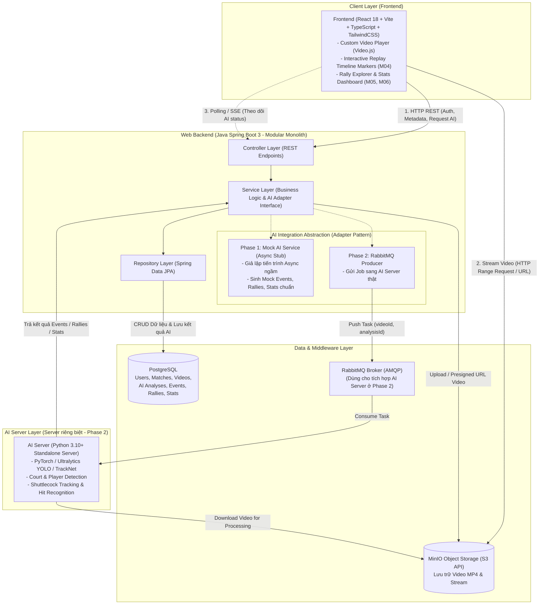
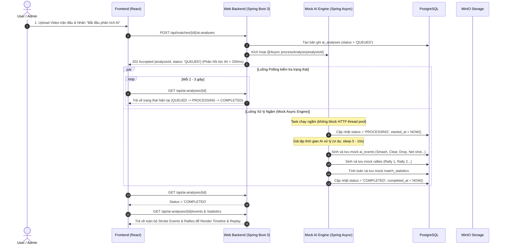

# ADR 001: Lựa chọn Tech Stack & Kiến trúc Hệ thống PBL6 Badminton

* **Trạng thái:** ACCEPTED
* **Ngày quyết định:** 2026-10-07
* **Dự án:** PBL6 - Badminton Match Analysis & Replay Platform
* **Người thực hiện:** Nhóm phát triển PBL6
* **Lựa chọn đã chốt:** **Phương án 2 (Spring Boot 3 + React + PostgreSQL + MinIO + RabbitMQ + AI Server riêng biệt)**

---

## 1. Bối cảnh & Yêu cầu Kỹ thuật (Context)

Dự án PBL6 Badminton là nền tảng quản lý trận đấu, phân tích video cầu lông tự động bằng AI, replay đồng bộ timeline sự kiện (strokes, rallies) và thống kê chuyên sâu. 

Dựa trên tài liệu yêu cầu `PBL6-Badminton_requirements.md`, hệ thống phải đáp ứng các ràng buộc phi chức năng (NFR) cốt lõi:
1. **NFR-PER-02 & NFR-AI-01:** AI processing phải chạy **bất đồng bộ (asynchronous)**, tuyệt đối **không được block HTTP request** (thời gian phản hồi API thông thường $\le 2s$ theo NFR-PER-01).
2. **NFR-AI-04:** **AI Server/Worker phải là một server riêng biệt tách rời khỏi Web Backend**, không chạy chung tiến trình với web server nhằm đảm bảo độ tin cậy và khả năng scale độc lập (NFR-SCA-01).
3. **NFR-AI-02 & NFR-AI-03:** Quản lý trạng thái xử lý AI rõ ràng (`QUEUED`, `PROCESSING`, `COMPLETED`, `FAILED`) và hỗ trợ cơ chế Retry khi gặp lỗi.
4. **NFR-VID-01, 02, 04:** Xử lý upload video dung lượng lớn, lưu trữ an toàn, hỗ trợ video streaming (HTTP Range Requests) cho tính năng Replay (M04).
5. **NFR-MNT-01:** Web Backend tổ chức theo mô hình phân lớp rõ ràng: **Controller - Service - Repository**.
6. **NFR-STO-01 & NFR-CON-01:** Dữ liệu sự kiện AI (`ai_events`, `rallies`, `match_statistics`) phải được lưu trữ quan hệ, đảm bảo tính toàn vẹn và nhất quán.

---

## 2. Chiến lược Triển khai 2 Giai đoạn (Phased Implementation Strategy)

Theo định hướng dự án hiện tại:
* **Giai đoạn 1 (Hiện tại - Core Web & Client):** 
  * Tập trung xây dựng hoàn chỉnh **Web Backend (Spring Boot 3)** và **Frontend (React)**.
  * Thiết kế kiến trúc theo mẫu **Adapter/Strategy Pattern** cho dịch vụ AI: Sử dụng **Mock AI Service (Asynchronous Stub)** để giả lập tiến trình AI (mô phỏng delay ngầm, chuyển đổi trạng thái `QUEUED` $\rightarrow$ `PROCESSING` $\rightarrow$ `COMPLETED` sau vài giây, và sinh dữ liệu Mock chuẩn cho `ai_events`, `rallies`, `match_statistics`).
  * Mục tiêu: Kiểm thử và hoàn thiện toàn bộ luồng nghiệp vụ end-to-end (Auth, Match CRUD, Video Streaming, Replay Timeline Markers, Rally sync, Statistics charts, Admin Dashboard, Retry flow) mà không phụ thuộc vào việc huấn luyện mô hình AI.
* **Giai đoạn 2 (Tích hợp AI Server thực tế):**
  * Triển khai **AI Server riêng biệt (Python Standalone Server)** chạy PyTorch/YOLO/TrackNet.
  * Kết nối AI Server qua **RabbitMQ Message Broker** (hoặc Webhook/Internal REST). Dữ liệu phân tích thật sẽ trả về thay thế mock data mà không cần sửa đổi kiến trúc core hay hợp đồng API của Web Backend và Frontend.

---

## 3. Sơ đồ Kiến trúc Tổng thể (Overall Architecture)

---

## 4. Luồng Xử lý AI Bất đồng bộ (với Mock Data ở Giai đoạn Hiện tại)

---

## 5. Chi tiết Tech Stack Đã Chốt (Phương án 2)

| Thành phần | Công nghệ lựa chọn | Vai trò & Mục đích trong dự án |
| :--- | :--- | :--- |
| **Frontend** | React 18, Vite, TypeScript, TailwindCSS, Video.js, TanStack Query | Giao diện người dùng, trình phát video kèm timeline đánh dấu cú đánh (M04), quản lý trạng thái, thư viện trận đấu. |
| **Web Backend** | **Java 17/21 + Spring Boot 3** (Spring Web, Spring Security, Spring Data JPA) | **Monolith Server** xử lý nghiệp vụ M01-M08, phân tầng chuẩn **Controller $\rightarrow$ Service $\rightarrow$ Repository** (NFR-MNT-01), bảo mật JWT. |
| **Database** | **PostgreSQL 15+** | Lưu trữ toàn bộ 7 thực thể dữ liệu quan hệ (`users`, `matches`, `videos`, `ai_analyses`, `ai_events`, `rallies`, `match_statistics`). |
| **File / Video Storage** | **MinIO** (Local S3 Object Storage) | Lưu trữ file video MP4 lớn (NFR-VID-01, NFR-VID-04), hỗ trợ streaming byte range cho replay video (M04). |
| **Message Broker** | **RabbitMQ** | Định tuyến tác vụ bất đồng bộ, xử lý hàng đợi và retry (NFR-AI-03) khi kết nối AI Server thật ở Phase 2. |
| **AI Integration** | **Adapter Pattern (Mock Service $\rightarrow$ Real AI Server)** | **Hiện tại:** Mock Async Service sinh dữ liệu mẫu đúng chuẩn DB để test. **Tương lai:** Server AI riêng biệt (Python) xử lý video thật. |

---

## 6. Đánh giá Ưu / Nhược điểm, Rủi ro & Giải pháp

### 6.1. Ưu điểm
1. **Chuẩn mực kiến trúc Enterprise & Học thuật:** Spring Boot phân tách cực kỳ chặt chẽ giữa Controller, Service và Repository (thỏa mãn 100% NFR-MNT-01), phù hợp hoàn hảo với tiêu chuẩn đồ án PBL tại trường Đại học Bách Khoa (DUT).
2. **Độc lập và an toàn nghiệp vụ (NFR-AI-04, NFR-PER-02):** Việc quy định AI là server riêng biệt và thiết kế sẵn interface Mock Adapter đảm bảo Web Backend không bao giờ phụ thuộc vào tiến trình AI. Web Server luôn phản hồi nhanh ($\le 2s$).
3. **Phát triển song song mượt mà:** Frontend và Backend có thể hoàn thiện 100% các tính năng phức tạp (Replay video đồng bộ timeline marker, phân tích rally, vẽ biểu đồ thống kê) ngay bây giờ nhờ Mock data chuẩn xác, không bị tắc nghẽn (bottleneck) chờ model AI.

### 6.2. Rủi ro & Giải pháp cho Sinh viên
* **Rủi ro tài nguyên máy (RAM):** Spring Boot và JVM ngốn RAM nhiều hơn Node.js.
  * *Giải pháp:* Cấu hình JVM tối ưu cho môi trường Dev (`-Xms256m -Xmx512m`). Ở giai đoạn 1 chưa cần chạy AI model PyTorch nặng, máy tính sinh viên hoàn toàn dư sức chạy Docker PostgreSQL + MinIO + Spring Boot + React.
* **Độ phức tạp của Spring Security & JPA:** Dễ mất thời gian cấu hình CORS, Filter, JWT và Mapping quan hệ One-to-Many giữa `ai_analyses` và `ai_events`/`rallies`.
  * *Giải pháp:* Thiết kế DTO và Entity tinh gọn, sử dụng Lombok để giảm thiểu mã lặp thừa, tách riêng Auth Security Filter Chain rõ ràng.
